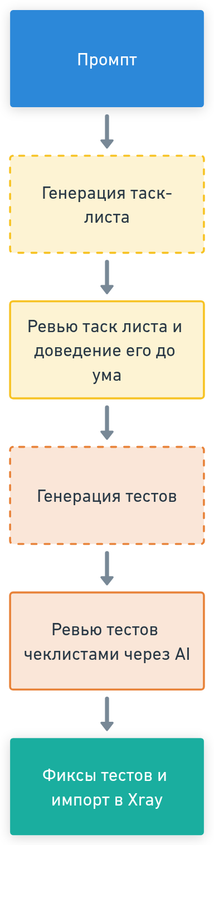

# Project Automation Scripts

Этот документ предоставляет наиболее полное техническое описание проекта, его архитектуры, компонентов и рабочих
процессов.

**Иерархия документации:**

* **`README.md` (этот файл):** Подробная документация для разработчиков и продвинутых пользователей. Описывает
  архитектуру, логику работы каждого скрипта, конфигурационные параметры и внутренние взаимосвязи.
* **`USAGE.md`:** Документация для пользователей. Описывает, как использовать основные функции инструмента для
  достижения конкретных целей (например, как сгенерировать компонентные тесты).
* **`RUNBOOK.md`:** Краткое пошаговое руководство (шпаргалка) для быстрого выполнения стандартных рабочих процессов.

---

## 1. Архитектура и Основные Концепции

Система предназначена для автоматизации создания тест-кейсов и построена на следующих принципах:

1. **Двухфазный рабочий процесс:**
    * **Фаза 1: Генерация Компонентных Тестов.** На этом этапе создаются атомарные проверки для отдельных
      UI-компонентов, экранов, их состояний (загрузка, ошибка, пустые данные) и сетевых запросов. Результатом является
      CSV-файл с созданными в Jira тестами, который служит "базой знаний" для следующего этапа.
    * **Фаза 2: Генерация Сценарных Тестов.** На основе ранее сгенерированных компонентных тестов и бизнес-требований
      создаются высокоуровневые end-to-end сценарии, которые описывают полные пользовательские пути.

2. **Управление через артефакты:**
   Процесс генерации управляется набором входных файлов (артефактов), таких как:
    * Технические требования (`req.md`)
    * Swagger-спецификация (`swagger.yaml`)
    * Результаты анализа дизайна (`tests_from_figma.csv`)
    * Шаблоны-инструкции для AI (`prompt_*.md`)

3. **Человек-в-цикле (Human-in-the-loop):**
   Ключевым звеном является AI (LLM), который генерирует JSON с тестами на основе предоставленного промпта. Однако
   обязательным шагом является ручное ревью сгенерированных тестов с использованием специальных чек-листов (
   `review_*.md`) для обеспечения качества и полноты покрытия.

<details open>
  <summary>Диаграмма использования артефактов</summary>
  
</details>

<details open>
  <summary>Порядок запросов с AI</summary>
  
</details>

---

## 2. Первоначальная настройка

Перед первым использованием необходимо настроить окружение.

1. **Установка зависимостей:**
   Выполните скрипт `setup.sh` из корневой директории. Он установит Python (через Homebrew, если необходимо), создаст
   виртуальное окружение в папке `venv` и установит все зависимости из `requirements.txt`.
   ```bash
   ./setup.sh
   ```

2. **Конфигурация:**
   Скопируйте `config_template.py` в `config.py` и заполните его своими данными.
   ```bash
   cp config_template.py config.py
   ```
   Ключевые параметры для настройки в `config.py`:

   ```python
   # --- Настройки Jira ---
   # URL вашего инстанса Jira
   JIRA_URL = "https://your-jira-instance.com"
   # Ключ проекта в Jira
   JIRA_PROJECT_KEY = "PROJ"
   # Ваш логин в Jira
   JIRA_USERNAME = "YOUR_JIRA_USERNAME"
   # Ваш пароль или API-токен для Jira
   JIRA_PASSWORD = "YOUR_JIRA_PASSWORD_OR_API_TOKEN"
   # Список глобальных меток, которые будут добавляться ко всем создаваемым тестам
   JIRA_LABELS = ["autotest-candidate"]
   # Тип задачи для тест-кейсов (обычно "Test")
   ISSUE_TYPE = "Test"
   # ID кастомного поля Xray для шагов теста
   XRAY_STEPS_FIELD = "customfield_10204"
   # ID кастомного поля для пути к тесту в репозитории (Test Repository Path)
   CUSTOMFIELD_TEST_REPOSITORY_PATH = "customfield_10211"
   # ID кастомного поля для типа тест-кейса (Component/Scenario)
   CUSTOMFIELD_TEST_CASE_TYPE = "customfield_12501"
   # ID кастомного поля для указания доски/команды
   CUSTOMFIELD_TEST_BOARD = "customfield_10703"

   # --- Настройки Figma ---
   # Ваш персональный токен доступа Figma
   FIGMA_TOKEN = "YOUR_FIGMA_PERSONAL_ACCESS_TOKEN"
   # URL файла Figma для анализа
   FIGMA_FILE_URL = "https://www.figma.com/file/your-file-id/file-name"
   # Масштаб для выгружаемых изображений (1 или 2 для retina)
   FIGMA_SCALE = 1
   
   # --- Настройки Swagger ---
   # Публичная ссылка на Swagger UI (используется для описаний в Jira)
   SWAGGER_URL = "https://example.com/swagger.yaml"
   # Локальный путь к swagger-файлу (используется для парсинга).
   # Если оставить пустым, будет использоваться артефакт по умолчанию.
   SWAGGER_LOCAL_PATH = ""

   # --- Фильтры для парсинга Figma ---
   FRAME_LIMIT = 10
   FRAME_BANNED = ("frame", "form", "icon")
   FRAME_INCLUDE = ("screen",)
   ELEMENT_BANNED  = ("icon", "decoration")
   ELEMENT_INCLUDE = ("section",)

   # --- Режим работы ---
   # "JIRA_EXPORT" - создавать задачи в Jira.
   # "FILE_EXPORT" - генерировать CSV-файл с тестами (для первого воркфлоу).
   OPERATIONAL_MODE = "FILE_EXPORT"

   # --- Прочие настройки ---
   # Установите True, чтобы сгенерированные файлы (промпты, json) открывались автоматически
   AUTOLAUNCH_FILES = False
   ```

---

## 3. Описание компонентов и скриптов

### `send_figma_tests_all_tests.py`

Основной скрипт для извлечения информации из Figma.

* **Назначение:** Подключается к API Figma, анализирует структуру файла, извлекает фреймы (экраны) и вложенные элементы,
  соответствующие заданным фильтрам, и скачивает их изображения.
* **Ключевая логика:**
    1. Использует `FigmaClient` для взаимодействия с API.
    2. `_collect_top_frames` находит все фреймы верхнего уровня, фильтрует их по именам (`FRAME_INCLUDE`,
       `FRAME_BANNED`) и сортирует по площади, чтобы обрабатывать самые крупные экраны в первую очередь.
    3. `_collect_elements` рекурсивно обходит дочерние элементы каждого фрейма и отбирает интерактивные слои по именам (
       `ELEMENT_INCLUDE`, `ELEMENT_BANNED`).
    4. Скачивает PNG-изображения для каждого отобранного экрана и элемента в папку `figma_screens/<RUN_ID>/`.
* **Режимы работы (`OPERATIONAL_MODE`):**
    * `"JIRA_EXPORT"`: Для каждого экрана и элемента создается задача в Jira типа "Test" (или указанного в `ISSUE_TYPE`)
      с помощью `JiraClient`. В шаги теста Xray помещается название и изображение элемента.
    * `"FILE_EXPORT"`: Создание задач в Jira пропускается. Вместо этого вся информация (названия, ссылки на Figma, пути
      к скачанным PNG) собирается и сохраняется в CSV-файл `create_final_tests/artifacts/tests_from_figma.csv`. Этот
      файл является критически важным артефактом для дальнейшей генерации компонентных тестов.

### `create_final_tests/folder_structure/gui_update_file_structure.py`

Скрипт для сборки единого файла требований из множества источников.

* **Назначение:** Предоставляет GUI (на базе `dearpygui`) для интерактивного выбора файлов и директорий с технической
  документацией.
* **Ключевая логика:**
    1. Читает конфигурацию из `task_list_configuration.md`, чтобы определить базовую директорию для сканирования.
    2. Строит дерево файлов и папок, позволяя пользователю отметить нужные.
    3. Собирает содержимое всех отмеченных файлов и объединяет их в единый markdown-файл `req.md`, который сохраняется в
       `create_final_tests/artifacts/`.

### `create_final_tests/prompt_generator.py`

Универсальный генератор промптов на основе шаблонов и артефактов.

* **Назначение:** Автоматизировать создание текстовых файлов-промптов для AI.
* **Ключевая логика:**
    1. Принимает на вход путь к конфигурационному JSON-файлу (например, `config_artifacts_component.json`).
    2. Из конфига читает путь к файлу-шаблону (`prompt_template_path`) и словарь артефактов (`artifacts`).
    3. Читает содержимое файла-шаблона.
    4. Последовательно заменяет плейсхолдеры (например, `{{REQ_CONTENT}}`) в шаблоне содержимым соответствующих
       файлов-артефактов.
    5. Сохраняет итоговый текст в выходной файл (`output_prompt_path`).
* **Исполнение:** Вызывается через shell-скрипты `generate_component_prompt.sh` и `generate_scenario_prompt.sh`.

### `create_final_tests/jira_sender.py`

Скрипт для отправки сгенерированных тест-кейсов в Jira.

* **Назначение:** Парсит JSON-файл с массивом тест-кейсов и создает для каждого соответствующую задачу в Jira.
* **Ключевая логика:**
    1. Принимает на вход путь к JSON-файлу (`--input`).
    2. Загружает схему теста из `json_scheme.yml`.
    3. Читает и парсит входной JSON-файл. Каждый объект в массиве валидируется по схеме `TestCase`. Невалидные тесты
       пропускаются с предупреждением.
    4. Для каждого валидного теста формирует структуру полей для API Jira, включая `summary`, `description`, `labels`,
       `priority` и кастомные поля. Шаги теста (`steps`) форматируются для поля Xray (`XRAY_STEPS_FIELD`).
    5. С помощью `JiraClient` создает задачу в Jira.
    6. **Опция `--download-csv`**: Если этот флаг передан, скрипт после создания всех задач выполняет JQL-запрос для их
       выборки и скачивает результат в виде CSV-файла в `create_final_tests/artifacts/component_tests.csv`.

### Вспомогательные файлы и артефакты

* `create_final_tests/artifacts/`: Центральная папка для всех промежуточных и итоговых артефактов.
    * `json_scheme.yml`: OpenAPI-схема, описывающая структуру объекта `TestCase`. Используется для валидации
      JSON-ответов от AI.
    * `prompt_component.md` / `prompt_scenario.md`: Шаблоны с инструкциями для AI. Содержат правила генерации,
      форматирования и плейсхолдеры для вставки артефактов.
    * `review_component.md` / `review_scenario.md`: Чек-листы для ручной проверки сгенерированных тестов. Помогают
      стандартизировать процесс ревью.
    * `component_tests.json` / `scenario_tests.json`: Файлы, в которые вручную сохраняются JSON-ответы от AI. Являются
      входными данными для `jira_sender.py`.
* `config_artifacts_component.json` / `config_artifacts_scenario.json`: Конфигурационные файлы для
  `prompt_generator.py`, определяющие, какие артефакты и в какой шаблон подставлять для каждого из воркфлоу.